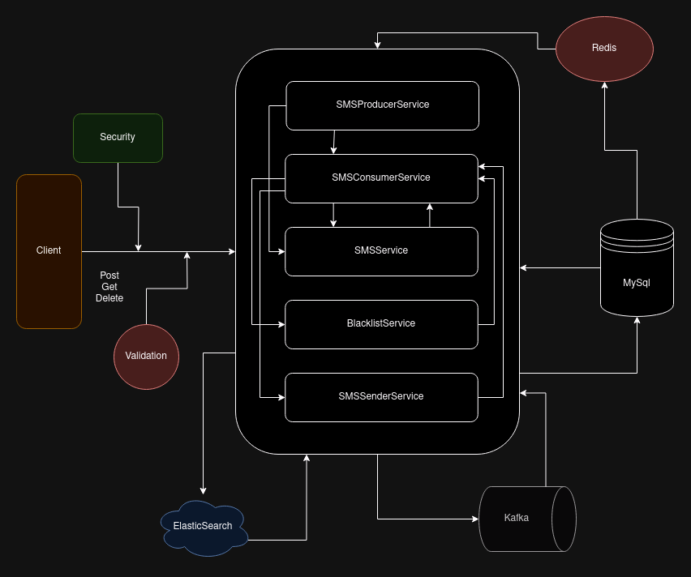
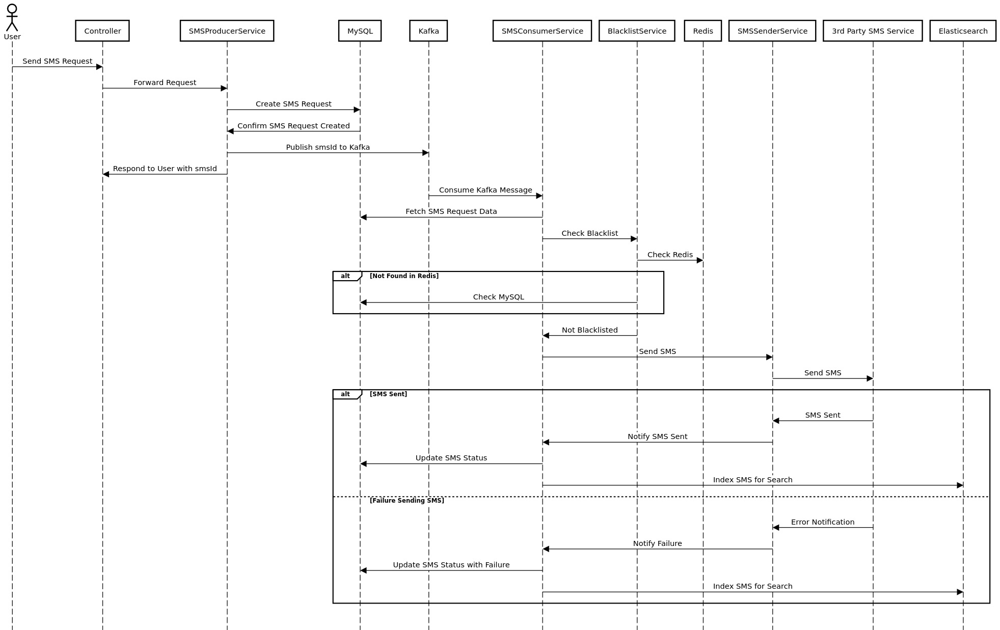

# SMS Notification Service API Documentation

## Overview

The SMS Notification Service API lets you send and manage SMS messages, handle blacklisted numbers, and search through SMS requests.

## Authentication

All requests must include an `Authorization` header with a token(dummy). Without this header, the server will reject the request.

**Header Example:**

```shell
Authorization: Bearer YOUR_TOKEN_HERE
```

## System Architecture

**Architecture Diagram:**



## Endpoints

### /sms/send

**Description:**

Sends an SMS message to the specified phone number.

**Sequence Diagram:**



**Method:** POST

**Request Body:**

```json
{
    "phoneNumber":"+14155552671",
    "message":"ello, Greetings from Meesho.Click here to know more about us:https://meesho.com."
}
```

**Validation:**

- `phoneNumber` must be a valid phone number in international format (e.g., +1234567890) or a valid Indian phone number without the country code (e.g., 9876543210).
- `message` must be a non-empty string.

**Response:**

```json
{
    "status": "success",
    "data": {
        "requestId": "129175de-bc81-4755-adcb-d904f4800a04",
        "comments": "SMS sent successfully!"
    }
}
```

### /sms/

**Description:**
Retrieves the details of a specific SMS request using its ID.

**Method:** GET

**Path Parameter:**

- `requestId` (required): The unique identifier of the SMS request.

**Validation:**

- `requestId` must be a valid UUID.

**Response:**

```json
{
    "status": "success",
    "data": {
        "id": "129175de-bc81-4755-adcb-d904f4800a04",
        "phoneNumber": "+14155552671",
        "message": "ello, Greetings from Meesho.Click here to know more about us:https://meesho.com.",
        "status": "FAILED",
        "failureCode": 7001,
        "failureComments": "Authentication failed.",
        "createdAt": "2024-08-06T13:58:35.019+00:00"
    }
}
```

### /blacklist

**Description:**

CRUD operations for managing blacklisted phone numbers.

**Endpoints:**

- **Create:** `POST /blacklist`
    - **Request Body:**
    -

    ```json
    {
      "phoneNumbers": ["+14155552671", "9876543210"]
    }
    ```

    - **Response:**

        ```json
        {
            "status": "success",
            "data": "Successfully blacklisted phone number"
        }
        ```


- **Read:** `GET /blacklist`
    - **Response:**

        ```json
        {
            "status": "success",
            "data": [
                "+919876543210",
                "+14155552671"
            ]
        }
        ```


- **Delete:** `DELETE /blacklist`
    - **Request Body:**

        ```json
        {
          "phoneNumbers": ["+14155552671"]
        }
        ```

    - **Response:**

        ```json
        {
            "status": "success",
            "data": "Successfully whitelisted phone number"
        }
        ```


### /sms/search/phone

**Description:**
Searches for SMS messages sent to a specific phone number within a date range.

**Method:** GET

**Query Parameters:**

- `phoneNumber` (required): The phone number to search for.
- `startDate` (optional): The start date for the search (format: YYYY-MM-DD).
- `endDate` (optional): The end date for the search (format: YYYY-MM-DD).
- `page` (optional): Page number for pagination(starts from 0).
- `size` (optional): Number of results per page.

**Response:**

```json
{
    "content": [
        {
            "id": "c9ce6e2b-8c4d-4cbd-bdf8-4adbe939b099",
            "phoneNumber": "+14155552671",
            "message": "hello, Greetings from Meesho.Click here to know more about us:https://meesho.com.",
            "status": "FAILED",
            "failureCode": 500,
            "failureComments": "Phone number is blacklisted",
            "createdAt": "2024-08-06T14:08:32.952+00:00"
        },
        ...
    ],
    "page": {
        "size": 20,
        "number": 0,
        "totalElements": 8,
        "totalPages": 1
    }
}
```

### /sms/search/message

**Description:**
Searches for SMS messages containing a specific message.

**Method:** GET

**Query Parameters:**

- `message` (required): The message content to search for.
- `page` (optional): Page number for pagination.
- `size` (optional): Number of results per page.

**Response:**

```json
{
    "content": [
        {
            "id": "c9ce6e2b-8c4d-4cbd-bdf8-4adbe939b099",
            "phoneNumber": "+14155552671",
            "message": "hello, Greetings from Meesho.Click here to know more about us:https://meesho.com.",
            "status": "FAILED",
            "failureCode": 500,
            "failureComments": "Phone number is blacklisted",
            "createdAt": "2024-08-06T14:08:32.952+00:00"
        },
        ...
    ],
    "page": {
        "size": 20,
        "number": 0,
        "totalElements": 8,
        "totalPages": 1
    }
}
```

---

## Error Handling

All endpoints will return appropriate HTTP status codes and error messages for invalid requests.

**Common Error Responses:**

- `400 Bad Request`: Invalid input parameters.
- `401 Unauthorized`: Missing or invalid Authorization header.
- `404 Not Found`: Requested resource not found.
- `500 Internal Server Error`: An unexpected error occurred.

**Error Response Example:**

```json
{
    "status": "error",
    "error": {
        "code": "400 BAD_REQUEST",
        "message": "Phone number +91987654321 is invalid"
    }
}
```

---

## Data Models

**SMS Model:**

```sql
+------------------+--------------+------+-----+---------+-------+
| Field            | Type         | Null | Key | Default | Extra |
+------------------+--------------+------+-----+---------+-------+
| id               | binary(16)   | NO   | PRI | NULL    |       |
| created_at       | datetime(6)  | YES  |     | NULL    |       |
| failure_code     | int          | YES  |     | NULL    |       |
| failure_comments | varchar(255) | YES  |     | NULL    |       |
| message          | varchar(255) | YES  |     | NULL    |       |
| phone_number     | varchar(255) | YES  |     | NULL    |       |
| status           | tinyint      | YES  |     | NULL    |       |
| updated_at       | datetime(6)  | YES  |     | NULL    |       |
+------------------+--------------+------+-----+---------+-------+

"status": "enum(PENDING, SENT, FAILED)"
```

**Blacklist Model:**

```sql
+--------------+--------------+------+-----+---------+-------+
| Field        | Type         | Null | Key | Default | Extra |
+--------------+--------------+------+-----+---------+-------+
| id           | binary(16)   | NO   | PRI | NULL    |       |
| created_at   | datetime(6)  | YES  |     | NULL    |       |
| phone_number | varchar(255) | YES  |     | NULL    |       |
+--------------+--------------+------+-----+---------+-------+
```

**SMSDocument Model:**

```json
{
  "id": "UUID",
  "phoneNumber": "string",
  "message": "string",
  "status": "enum(PENDING, SENT, FAILED)",
  "failureCode": "integer",
  "failureComments": "string",
  "createdAt": "timestamp"
}
```